# Metaformers (now in colors!)
Peer-reviewed? Not yet. Color-coded? Absolutely.

# Clone the repo
git clone https://github.com/m10ust/metaformers.git

cd metaformers

# Run a seed loop (Mac/BSD)
python metaformers_v5.1.py or ./metaformers_v5.1.py after doing chmod +x metaformers_v5.1.py the scriipt will ask you if you want your seed prompt to be reframe as a concise question (Y/n) n. Seed prompt = Question to ask. Then the script will ask you how many iterations you want which means how many turns and this is where things gets nuts. (30) turns selection. Now the Questioner will ask the Creator for 30 turns each turns which a prompt as they see fit and beleive me they do.

# Run on Linux
python metaformers_linux.py (currently the Linux script is based on the old version of Metaformers which means you don't get a prompt to choose which models you want per roles. You need Dolphin3, GPT-OSS, Llama2-uncensored of just use the models you want by tweaking the scripts.) Coming soon V5 for Linux!

----------------------------------------------------------------------------------------------

Metaformers is an experimental AI orchestration stack designed to **set a conversation in motion and let it evolve**.  
Starting from a single **initial prompt** — the *seed question* — three models engage in a structured, iterative dialogue loop, building on each other’s outputs until entirely new insights and behaviors emerge. Much like a live peer-reviewed whitepaper if you seed prompt is about science.

---

##     Methodology

Metaformers implements a structured dialogue orchestration protocol inspired by peer-review dynamics. A single seed prompt initiates the cycle. Roles are distributed across independent models:
	•	Questioner (Q) – refines the problem space, posing a focused claim or question (Reviewer #1: skeptical probe).
	•	Creator (C) – generates a structured answer or proposal, optionally seeding the next iteration (Reviewer #2: constructive scope/assumption check).
	•	Scriber (S) – condenses outputs into bullet summaries and captures claims, open issues, and TODOs (Archivist).
	•	MediatorQ (M) – periodically injects meta-critique to re-frame or sharpen direction (Meta-reviewer).
	•	Logger (L) – maintains a running canonical record (master.md and index.md), functioning as the program chair who tracks issues, anomalies, and trajectory.

Each turn produces dual artifacts:
	1.	Dialogue Trace – the live exchange between Q, C, S, and M.
	2.	Knowledge Record – structured entries in master.md and cross-references in index.md, ensuring continuity and reproducibility.

This design enables emergent behavior to surface safely: iterative prompting reduces hallucinations, multiple roles enforce checks and balances, and logging ensures auditability. In practice, the loop functions as a synthetic peer-review workshop, converging on insights or anomalies over successive turns.

## 🌊 The Metaformers Loop

The **loop** is the heart of Metaformers.  
It follows a simple but powerful arc:

1. **Initial Prompt**  
   A single, well-crafted question or statement — the seed that starts the flow.  
   Example:  
   > "Using local LLMs running on PyTorch to get emergent behaviors from a PostgreSQL database and Python."

2. **Agent Turn-Taking**  
   - **LLaMA 2 / Dolphin3 or any model you choose** reason through the problem, propose steps, ask clarifying questions.  
   - **GPT-OSS or model of your choice** reframes or contrasts ideas to inject new perspectives.  
   - Each model responds to the *previous* model’s output, creating a chain reaction of refinements.

3. **Emergent Behavior Phase**  
   Around turn 15–30, patterns and unexpected strategies start appearing — the models surprise even their human observer.

4. **Actionable Blueprinting**  
   The loop naturally shifts toward concrete implementation steps, database queries, code snippets, and structured execution plans.

---

## 🚀 Features
- **Three-Model Synergy** — Local LLaMA2, Dolphin3, and GPT-OSS in a continuous dialogue loop.
- **PostgreSQL Context** — Real-time queries and reasoning over structured datasets.
- **Emergent Reasoning** — Watch unplanned insights surface from the interaction.
- **Agent Autonomy Simulation** — Models appear to “debate” and “collaborate” without manual intervention mid-loop.
- **Full Local Control** — Runs entirely on local PyTorch, GPU-accelerated.

---

## 📦Suggested Stack Components
| Component         | Purpose |
|-------------------|---------|
| **PyTorch**       | Core tensor engine for model execution |
| **LLaMA 2 / Dolphin3** | Open-source LLMs used as Questioner (Llama 2) and Mediator/Reviewer/wildcard (Dolphin3) for perspective contrast and wildcard injection  |
| **GPT-OSS**       | Open-source GPT-compatible agent donig the main reasoning and heavylifting |
| **PostgreSQL**    | Data source for context injection |
| **Python**        | Orchestration of turns, logging, and DB access |
| **JSON Logs**     | Structured iteration transcripts |

PS: The version 5 of the script (metaformers_v5.py) let you choose the model you want by listing all your model and letting you make a selection. Thought I would mention it. 

PS: You don't need PyTorch and PostgreSQL to test the loop. The two main scripts (metaformers_v5.py (MacOS and BSD-friendly) and metaformers_linux.py (Linux-friendly and can accomodate slower rigs) in the root folder are designed to work with only Python and Ollama + models of your choice installed localy. The PyTorch implementation is at early stage and for advanced users confortable with pgvector (PostgreSQL) and PyTorch. The ingest.py script is what you use to make ingestion of .txt files or whathave you, currently it is configured for txt files. Then you run the rag_chat.py to chat with the models on IE what they have ingested last etc... It's possible, actually 100% sure the scripts have my local configs so replace them if you want to use them. Building a strong database is essential here so everything works well. Unexperienced users can still use the Metaformers main scripts and have fun since it only uses Python and Ollama. Anyone with Python and Ollama installed can instantly start experimenting. This is the way Metaformers was designed to be experimented with in the first place. No Pytorch and PostgreSQL non-sense. Local & private + fully recursive :)

```mermaid
flowchart TD
    %% Metaformers Peer-Review Loop
    A[Seed / Prior Turn] --> Q["Questioner<br/>• Refines/presses claim<br/>• Poses 1 focused question"]
    Q --> C["Creator<br/>• Proposes answer & structure<br/>• May emit NextPrompt"]
    C -->|every N turns| M["MediatorQ<br/>• Meta-critique / sharpen next step"]
    C --> S["Scriber<br/>• 2–4 bullet summary<br/>• Captures claims & TODOs"]
    S --> L["Logger (master.md)<br/>• Turn header<br/>• Role blocks<br/>• NextTopic hint"]
    M --> L

    %% Feedback & Emergence
    L -->|AUTO_CHAIN on| Q
    C -. emergent prompts .-> Q
    Q -. anomaly flags .-> L

    %% Roles as “peer reviewers”
    subgraph ReviewDynamics[Peer-Review Dynamics]
      RV1[Questioner ≈ Reviewer #1<br/>skeptical probe]
      RV2[MediatorQ ≈ Reviewer #2<br/>scope/assumption check]
      CH[Archivist/Logger ≈ Program Chair<br/>tracks issues]
    end

    Q --- RV1
    M --- RV2
    L --- CH

    %% Health checks
    classDef role fill:#1f77b4,stroke:#0e3d66,color:#fff;
    classDef proc fill:#2ca02c,stroke:#135a13,color:#fff;
    classDef meta fill:#bcbd22,stroke:#6d6f14,color:#111;
    class Q,RV1 role
    class C proc
    class M,RV2 meta
    class S,L,CH meta
```

---

## 🧠 Example Loop Flow

[Turn 01] LLaMA2: The seed prompt suggests a data-driven emergent strategy…
[Turn 02] Dolphin3: Let’s formalize this into a 3-step process involving…
[Turn 03] GPT-OSS: Adding a recursive data shaping layer could amplify…
…
[Turn 24] LLaMA2: This resembles a meta-agent evolution cycle. We should…
[Turn 25] Dolphin3: That implies adding a memory bank to the PostgreSQL schema…
[Turn 26] GPT-OSS: Yes — and here’s the pseudo-code to implement it.

## What's Next?

I am currently working on a **metaformers_v6_builder.py** script that applies the same cool peer-reviewing and multi-role agentic system you see in metaformers but for building apps autonomously in a Docker env. This will be the first agentic peer-reviewed, self-improving app builders out in the wild and I am very excited to show it to you. I should be ready in a couple of days top. :)

Use it in a responsible manner. Adding powerful models in this loops could have deep implications. Change models as needed in the scripts to fit your tech stack. Stay curious and feed the loops!
